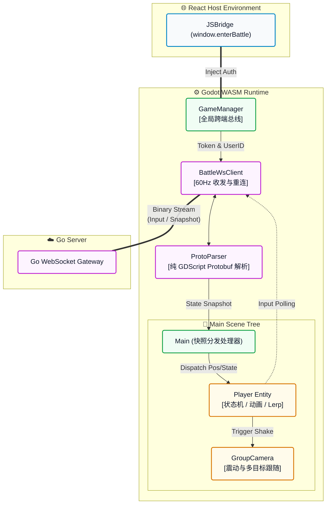

-----

# 🌌 AsterNova Game Client (Godot Engine)

   

> **"Feel the impact, not the latency."** — 极致的 Web 端高频动作渲染引擎。

**AsterNova Game Client** 是整个游戏系统的核心表现层。本项目基于 Godot 4 构建，并专为 WebAssembly (WASM) 运行环境量身定制。在严格的**服务端权威 (Server-Authoritative)** 架构下，本客户端完全剥离了核心物理裁决权，专注于“高频输入采集”、“网络快照平滑插值 (Lerp)”以及“硬核打击感 (Game Feel) 的视觉还原”。

## 🗺️ 引擎运行时架构 (Engine Runtime Architecture)

Godot 客户端作为一个黑盒沙箱，内部运行着严格的同步与渲染循环，并通过双向 JSBridge 与外层 React 容器进行状态握手：



## 🚀 核心工程化系统 (Core Systems)

### 1\. 服务端权威与平滑插值 (Server-Authoritative Sync)

  * **盲动与剥夺:** 客户端仅负责采集按键/虚拟摇杆的输入向量，不再修改本地的绝对坐标，所有位置均以 Go 后端下发的快照为准。
  * **Lerp 平滑补偿:** 针对 60Hz 物理快照，使用 `MoveToward` 与 `Lerp` 算法进行视觉平滑。即使在网络抖动时，远端玩家的移动与转身 (RotY) 依然如丝般顺滑。
  * **预测锁 (Prediction Lock):** 为解决网络延迟导致的“表现回扯”，引入 0.35s 预测锁。在本地预判受击的瞬间锁定状态，防止被旧网络快照强行打断击退表现。

### 2\. 工业级打击感引擎 (Hardcore Game Feel)

  * **Hit-Stop (卡肉机制):** 采用精准的时间膨胀控制。普攻命中触发 `0.08s` 卡肉，互撞拼刀触发 `0.15s` 卡肉。命中瞬间引擎时间 (Engine TimeScale) 骤降至 `5%`，完美模拟刀刃入肉的阻力感。
  * **动态镜头撕裂 (Screen Shake):** 根据受击强度与技能类型（普攻/大招），触发基于衰减算法的屏幕震动，强化视觉张力。

### 3\. 轻量级网络与序列化 (Lightweight Networking)

  * **Zero-Dependency Protobuf:** 为了保证 WASM 包体的极简，**摒弃了臃肿的第三方插件**，自研 `ProtoParser.gd`。仅用几百行纯 GDScript 实现了 Protobuf 3 协议的二进制解码与编码，极致压榨带宽。

### 4\. 跨平台交互适配 (Cross-Platform Input)

  * **动态虚拟摇杆:** 自动嗅探运行环境，当检测到 Mobile 标识或触屏操作时，动态激活左下角/右下角的虚拟摇杆 (Virtual Joystick)，并根据设计分辨率自动重置锚点 (Anchors)，防止画面缩放导致 UI 偏移。

## 📁 核心目录拓扑

```plaintext
AsterNova-Godot/
├── assets/                     # 核心美术与音频资源
│   ├── map_picture/            # 赛博珍珠白竞技场地图
│   └── music/game/             # 池化音效资源 (Hit, Dash, Clash)
├── proto/                      # Protobuf 协议定义 (game.proto)
├── scene/                      # 实体与逻辑场景
│   ├── group_camera/           # 多目标动态缩放相机逻辑
│   ├── player/                 # 核心：战斗状态机与实体控制器
│   └── roles/                  # 职业差异化继承 (如 Role1_Speedster)
├── scripts/                    # 全局单例与单体控制脚本
│   ├── AudioManager.gd         # 全局音频池管理器
│   ├── BattleWsClient.gd       # WebSocket 网络长连接与粘包处理
│   ├── GameManager.gd          # Wasm 与 React 的跨端交互总线
│   └── ProtoParser.gd          # 🚀 自研轻量级 Protobuf 序列化器
└── export_presets.cfg          # WebAssembly 导出配置矩阵
```

## 🛠️ 构建与导出指南 (Build & Export)

1.  **引擎要求:** 请使用 Godot `4.2+` 版本打开本工程。
2.  **本地调试:** \* 由于强制了 Server-Authoritative 架构，独立运行客户端将无法移动。
      * 必须确保 Go 后端网关 (`localhost:8081`) 处于运行状态，并在编辑器 `GameManager.gd` 中配置 Mock Token。
3.  **导出 WebAssembly (WASM):**
      * 点击 `项目 (Project)` -\> `导出 (Export)`。
      * 选择 `Web` 预设。
      * **导出路径必须指向:** `../asternova-web-client/public/godot/GoDot_game.html` (配合外层 Next.js 的静态托管)。
      * *注意：导出时确保去除了 Debug 选项以获得最佳体积与性能。*

-----

*Forged in Godot. Designed for the browser. Built by **TimeCraker**.*

-----
